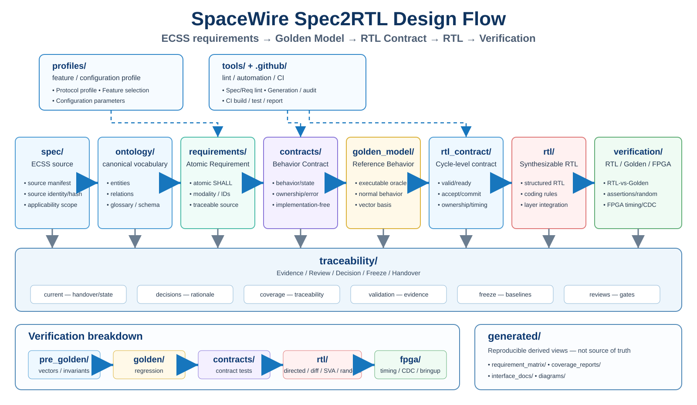

# SpaceWire Spec2RTL

ECSS-E-ST-50-12C Rev.1 기반으로 SpaceWire Golden Model, Verification Oracle, FPGA RTL을 개발하기 위한 engineering repository입니다.

## Source of Truth

- Git: requirement 해석, behavior contract, Golden Model, RTL Contract, RTL, verification evidence, traceability의 정본
- Original specification: 변경 금지 reference
- generated output: source artifact와 tool에서 재생성되는 derived artifact이며 engineering source of truth가 아님
- Project restart point: `traceability/current/CURRENT_HANDOVER.md`

## Engineering Flow

```text
spec
  -> ontology
  -> requirements
  -> contracts
  -> golden_model
  -> rtl_contract
  -> rtl
  -> verification
```

`traceability/`은 전 단계의 decision/evidence/governance를 기록하고, `tools/`와 `.github/`는 자동 검증을 수행합니다.

## Repository Boundaries

| Directory | Put here | Do not put here |
|---|---|---|
| `spec/` | source manifest, immutable-spec metadata, clause/source indexing | interpreted requirements, design decisions, generated reports |
| `ontology/` | canonical entities, relations, vocabulary/schema | protocol behavior, RTL timing, test results |
| `requirements/` | atomic requirements preserving normative modality/source | implementation choices, executable model code, review evidence |
| `contracts/` | implementation-independent behavior/state/ownership/error contracts | cycle-level signal timing, FPGA-specific choices, RTL |
| `profiles/` | optional-feature/configuration profiles used to select behavior | core normative requirements, ad-hoc design notes |
| `golden_model/` | executable implementation-independent protocol/reference behavior | RTL timing assumptions, FPGA primitives, test-only mocks as truth |
| `rtl_contract/` | cycle-level interfaces, accept/commit semantics, ownership, buffering/timing boundaries | synthesizable RTL, semantic requirements duplicated as prose |
| `rtl/` | synthesizable SystemVerilog implementation grouped by layer/integration role | testbench-only code, generated reports, unresolved design rationale |
| `verification/` | vectors, invariants, contract tests, RTL-vs-Golden, assertions, random/coverage, FPGA verification | source requirements, production RTL, governance decisions |
| `traceability/` | handover, decisions, issues, coverage mapping, validation evidence, freeze/review records | behavior implementation, duplicated source artifacts |
| `tools/` | lint/generation/audit/coverage automation | product RTL, manually maintained evidence copies |
| `generated/` | reproducible matrices/reports/interface docs/diagrams produced from source artifacts | manually authored engineering truth or files that cannot be regenerated |
| `.github/` | CI workflows and repository automation | design source, verification evidence itself |

## Placement Rule

파일 위치는 **내용(topic)** 보다 **역할(authority/lifecycle)** 로 결정합니다.

1. 규격의 원문/출처를 가리키는가? → `spec/`
2. normative statement를 atomic form으로 보존하는가? → `requirements/`
3. 구현 독립적인 protocol behavior를 정의하는가? → `contracts/` 또는 `golden_model/`
4. clock/cycle/interface/ownership 경계를 정하는가? → `rtl_contract/`
5. 실제 합성 가능한 구현인가? → `rtl/`
6. 어떤 정본을 검증하는 test/evidence인가? → `verification/`
7. 판단·승인·freeze·coverage·handover 기록인가? → `traceability/`
8. 다른 정본으로부터 재생성 가능한가? → `generated/`

하나의 파일이 두 역할을 가지면 분리합니다. 예를 들어 설계 결정은 `traceability/decisions/`, 그 결정으로 확정된 cycle contract는 `rtl_contract/`에 둡니다.

## Generated Artifacts

```text
generated/
├─ requirement_matrix/
├─ coverage_reports/
├─ interface_docs/
└─ diagrams/
```

원칙: generated 파일을 사람이 직접 수정하여 정본으로 승격하지 않습니다. 사람이 유지해야 하는 내용이 생기면 해당 source directory로 옮기고 generated output은 다시 생성합니다.

---

## Design Flow Diagram



Detailed view: `docs/SpaceWire_Spec2RTL_Flow.md`
